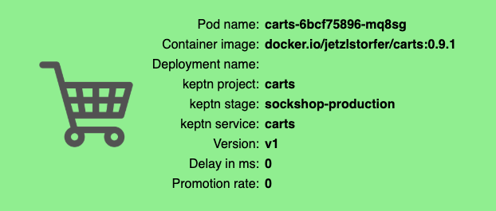

# Deploying the carts service

To deploy the service into your Kubernetes cluster, you can use the keptn CLI to trigger a new deployment. 

To do so, please execute the following command:

```console
keptn send event new-artifact --project=sockshop --service=carts --image=docker.io/keptnexamples/carts --tag=0.8.1
```

This will inform keptn about the availability of a new artifact (`keptnexamples/carts:0.8.1`). As a result, keptn will trigger a multi-stage deployment of that service. During the deployment of the service, a number of various different services that are responsible for different tasks are involved, such as:

  - **github-service**: This service modifies the configuration stored in the repository in order to specify the desired image for the carrts service to be deployed (in that case `keptnexamples/carts:0.8.1`).

  - **helm-service**: This service checks out the configuration repository and deploys the service using `helm`.

  - **jmeter-service**: Responsible for running jmeter tests which are specified in the code repository of the `carts` service.

  - **pitometer-service**: Evaluates performance test runs, if quality gates are enabled (more on that later).

  - **gatekeeper-service**: Decides wether an artifact should be promoted into the next stage (e.g., from dev to staging), or if an artifact should be rejected.

To gain an overview of all services involved in the deployment/release of the service, you can use the **keptn's bridge**, which you have set up earlier.

# View the carts service

To make the carts service accesible from outside the cluster and to support blue/green deployments, keptn automaticalliy creates **Istio** VirtualServices that direct requests to certain URLs to the correct service instance. You can retrieve the URLs for the carts service for each stage as follows:

```console
echo http://carts.sockshop-dev.$(kubectl get cm keptn-domain -n keptn -o=jsonpath='{.data.app_domain}')

echo http://carts.sockshop-staging.$(kubectl get cm keptn-domain -n keptn -o=jsonpath='{.data.app_domain}')

echo http://carts.sockshop-production.$(kubectl get cm keptn-domain -n keptn -o=jsonpath='{.data.app_domain}')
```

Navigate to the URLs to inspect your carts service. In the production namespace, you should receive an output similar to this:



---

[Previous Step: Onboarding carts service](../01_Onboarding_carts_service) :arrow_backward: :arrow_forward: [Next Step: Introducing quality gates](../03_Introducing_quality_gates)

:arrow_up_small: [Back to overview](https://github.com/johannes-b/keptn-hackfest2019#overview)