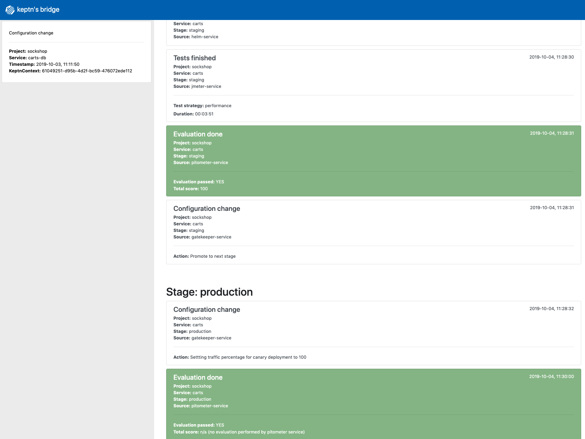

# Introducing quality gates

Since you have already set up your cluster to be monitored by Dynatrace, Keptn can use its information to evaluate performance tests and to decide wether an artifact should be promoted, based on quality gates. **Quality gates** allow you to define service level objectives (such as the response time of a service) that must not be violated by a service. If these criteria are met, an artifact will be allowed to proceed to the next stage, otherwise the deployment will be rolled back automatically. 

You can specify quality gates in two files, namely the `service-indicators.yaml` file, which describes the available types of metrics and their data sources (e.g., Prometheus or Dynatrace), and the `service-objectives.yaml` file, which describe the desired values for those metrics.

In this workshop, we will be using Dynatrace to retrieve metrics.

Therefore, we will add the service indiators as well as the service objects by executing the following commands:

```console
keptn add-resource --project=sockshop --service=carts --stage=staging --resource=service-indicators.yaml --resourceUri=service-indicators.yaml
```

```console
keptn add-resource --project=sockshop --service=carts --stage=staging --resource=service-objectives-dynatrace-only.yaml --resourceUri=service-objectives.yaml
```

Now, you have successfully activated the quality gate and your carts service will only be promoted into production if it adheres to the quality gates (response time < 1s).

# Deployment of a slow implementation of the carts service

To demonstrate the benefits of having quality gates, we will now deploy a version of the carts service (**version 0.9.2**) with a terribly slow response time. To trigger the deployment of this version, please execute the following command in your docker container:

  ```console
  keptn send event new-artifact --project=sockshop --service=carts --image=docker.io/jetzlstorfer/carts --tag=0.9.2
  ```

After some time, this new version will be deployed into the `dev` stage. If you look into the `shipyard.yaml` file that you used to create the `sockshop` project, you will see that in this stage, only functional tests are executed. This means that even though version has a slow response time, it will be promoted into the `staging` environment, because it is working as expected on a functional level. You can verify the deployment of the new version into `staging` by navigating to the URL of the service in your browser using the following URL:

  ```console
  echo http://carts.sockshop-staging.$(kubectl get cm keptn-domain -n keptn -o=jsonpath='{.data.app_domain}')
  ```

On the info homepage of the service, the **Version** should now be set to **v2**, and the **Delay in ms** value should be set to **1000**. (Note that it can take a few minutes until this version is deployed after sending the `new-artifact` event.)


As soon as this version has been deployed into the `staging` environment, the `jmeter-service` will execute the performance tests for this service. When those are finished, the `pitometer-service` will evaluate them using Dynatrace as a data source. At this point, it will detect that the response time of the service is too high and mark the evaluation of the performance tests as `failed`.

As a result, the new artifact will not be promoted into the `production` stage. Additionally, the traffic routing within the `staging` stage will be automatically updated in order to send requests to the previous version of the service. You can again verify that by navigating to the service homepage and inspecting the **Version** property. This should now be set to **v1** again.


# Deployment of a carts version without the slowdown

To demonstrate that the quality gate opens and allows promoting a version into production, which adheres to the quality objectives, we will now deploy a new version of the carts service (**version 0.9.3**). This version has fixed the slowdown.

  ```console
  keptn send event new-artifact --project=sockshop --service=carts --image=docker.io/jetzlstorfer/carts --tag=0.9.3
  ```

As a result, the new artifact will be promoted into the `production` stage. Please follow the logs in the Keptn's bridge to verify that:



---

[Previous Step: Deploying the carts service](../02_Deploying_the_carts_service) :arrow_backward: :arrow_forward: [Next Step: (optional) Self-healing](../04_Self_Healing)
