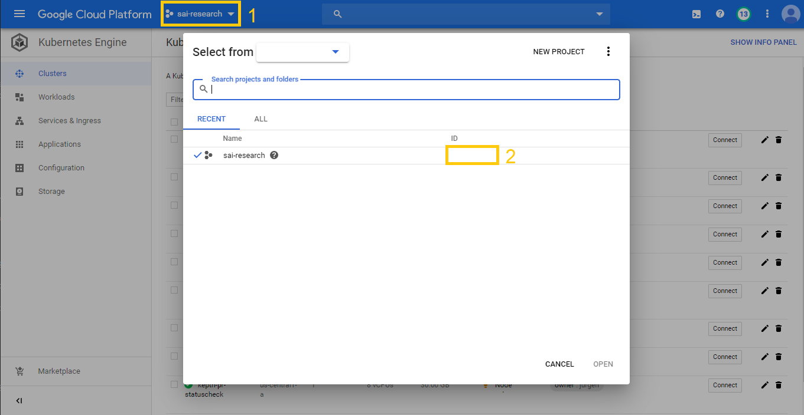
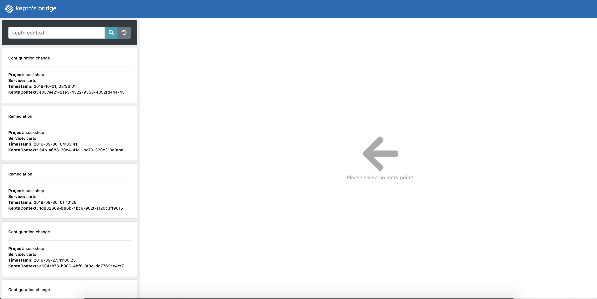

# keptn-hackfest2019
Instructions for the workshop "Building unbreakable automated multi-stage pipelines with keptn" given @Lakeside Hackfest 2019

# Overview
In this workshop, you will get hands-on experience with the open source framework [keptn](https://keptn.sh), and see how it can help you to manage your cloud-native applications on Kubernetes

# Pre-requisites

## 1. Accounts

1. **Dynatrace** - Assumes you will use a [trial SaaS dynatrace tenant](https://www.dynatrace.com/trial) and created a PaaS and API token.  See details in the [keptn docs](https://keptn.sh/docs/0.4.0/monitoring/dynatrace/)
1. **GitHub** - Assumes you have a github account and a personal access token with the persmissions keptn expects. See details in the [keptn docs](https://keptn.sh/docs/0.4.0/installation/setup-keptn-gke/)
1. **Cloud provider account** - Highly recommend to sign up for personal free trial as to have full admin rights and to not cause any issues with your enterprise account. Links to free trials
   * [Google](https://cloud.google.com/free/)
   * [Azure](https://azure.microsoft.com/en-us/free/)

## 2. Github Org

Keptn expects all the code repos and project files to be in the same GitHub Organization. So create a github new github organization for the keptn-orders for Keptn to use and for the keptn-orders application repos to be forked.  See details in the [github docs](https://github.com/organizations/new)

Suggested gihub organization name: ```<your last name>-keptn-hackfest-<cloud provider>```, e.g.: ```braeuer-keptn-hackfest-gcloud```

## 3. Tools

In this workshop we are going to use a pre-built Docker image that already has the required tools installed. The only requirement is that you have Docker installed on your machine. You can install it using the instructions on the [Docker Homepage](https://docs.docker.com/install/)

# Provision Cluster and Install Keptn

Now, it's time to set up your workshop environment. During the setup, you will need the following values. We recommend to copy the following lines into an editor, fill them out and keep them as a reference for later:

```
Dynatrace Host Name (e.g. abc12345.live.dynatrace.com):
Dynatrace API Token:
Dynatrace PaaS Token:
GitHub User Name:
GitHub Personal Access Token:
GitHub User Email:
GitHub Organization:
========Azure Only=========
Azure Subscription ID:
Azure Location: francecentral
========GKE Only===========
Google Project:
Google Cluster Zone: us-east1-b
Google Cluster Region: us-east1
```

The **Azure Subscription ID** can be found in your [Azure console](https://portal.azure.com/?quickstart=true#blade/Microsoft_Azure_Billing/SubscriptionsBlade):


The **Google Project** can be found at the top bar of your [GCP Console](https://console.cloud.google.com):




To start the docker container you will use for this workshop, please execute:

```
docker run -d -t bacherfl/keptn-demo
```

Afterwards, you can SSH into this container. First, retrieve the `CONTAINER_ID` of the `keptn-demo` container:

```
docker ps
```

Then, use that ID to SSH into the container:

```
docker exec -it <CONTAINER_ID> /bin/sh -c "[ -e /bin/bash ] && /bin/bash || /bin/sh"
```

When you are in the container, you need to log in to your PaaS account (GCP or AKS):

  - If you are using **GCP**, execute `gcloud init`
  - On **Azure**, execute `az login`

when is is done, navigate into the `scripts` folder:

```
cd scripts
```

Here you will find multiple scripts used for the setup and they must be run the right order.  Just run the setup script that will prompt you with menu choices.
```
./setup.sh <deployment type>
```
NOTE: Valid 'deployment type' argument values are:
* gke = Google
* aks = Azure

The setup menu should look like this:
```
====================================================
SETUP MENU for Azure AKS
====================================================
1)  Enter Installation Script Inputs
2)  Provision Kubernetes cluster
3)  Install Keptn
4)  Install Dynatrace
5)  Expose Keptn's Bridge
----------------------------------------------------
99) Delete Kubernetes cluster
====================================================
Please enter your choice or <q> or <return> to exit
```

## 1) Enter Installation Script Inputs

Before you do this step, be prepared with your github credentials, dynatrace tokens, and cloud provider project information available.

This will prompt you for values that are referenced in the remaining setup scripts. Inputted values are stored in ```creds.json``` file. For example on GKE the menus looks like:

```
===================================================================
Please enter the values for provider type: Google GKE:
===================================================================
Dynatrace Host Name (e.g. abc12345.live.dynatrace.com)
                                       (current: DYNATRACE_HOSTNAME_PLACEHOLDER) : 
Dynatrace API Token                    (current: DYNATRACE_API_TOKEN_PLACEHOLDER) : 
Dynatrace PaaS Token                   (current: DYNATRACE_PAAS_TOKEN_PLACEHOLDER) : 
GitHub User Name                       (current: GITHUB_USER_NAME_PLACEHOLDER) : 
GitHub Personal Access Token           (current: PERSONAL_ACCESS_TOKEN_PLACEHOLDER) : 
GitHub User Email                      (current: GITHUB_USER_EMAIL_PLACEHOLDER) : 
GitHub Organization                    (current: GITHUB_ORG_PLACEHOLDER) : 
Google Project                         (current: GKE_PROJECT_PLACEHOLDER) : 
Cluster Name                           (current: CLUSTER_NAME_PLACEHOLDER) : 
Cluster Zone (eg.us-east1-b)           (current: CLUSTER_ZONE_PLACEHOLDER) : 
Cluster Region (eg.us-east1)           (current: CLUSTER_REGION_PLACEHOLDER) :
```

## 2) Provision Kubernetes cluster

This will provision a Cluster on the specified cloud deployment type using the platforms CLI. This script will take several minutes to run and you can verify the cluster was created with the the cloud provider console.

The cluster will take 5-10 minutes to provision.

This script at the end will run the 'Validate Kubectl' script.  

## 3) Install Keptn

This will install the Keptn control plane components into your cluster.  The install will take 5-10 minutes to perform.

**NOTE**: Internally, this script will perform the following:
1. clone https://github.com/keptn/installer.  This repo has the cred.sav templates for building a creds.json file that the keptn CLI can use as an argument
1. use the values we already captured in the ```2-enterInstallationScriptInputs.sh``` script to create the creds.json file
1. run the ```keptn install -c=creds.json --platform=<Cluster>``` 
1. run the 'Show Keptn' helper script

## 4) Install Dynatrace
This will install the Dynatrace OneAgent Operator into your cluster.  The install will take 3-5 minutes to perform.

NOTE: Internally, this script will perform the following:
1. clone https://github.com/keptn/dynatrace-service.  This repo has scripts for each platform to install the Dyntrace OneAgent Operator and the cred_dt.sav template for building a creds_dt.json file that the install script expects to read
1. use the values we already captured in the ```1-enterInstallationScriptInputs.sh``` script to create the creds_dt.json file
1. run the ```/deploy/scripts/deployDynatraceOn<Platform>.sh``` script in the dynatrace-service folder
1. run the 'Show Dynatrace' helper script

## 5) (optional) Expose Keptn's Bridge

The [keptn’s bridge](https://keptn.sh/docs/0.4.0/reference/keptnsbridge/) provides an easy way to browse all events that are sent within keptn and to filter on a specific keptn context. When you access the keptn’s bridge, all keptn entry points will be listed in the left column. Please note that this list only represents the start of a deployment of a new artifact and, thus, more information on the executed steps can be revealed when you click on one event.



In the default installation of Keptn, the bridge is only accessible via `kubectl port-forward`. To make things easier for workshop participants, we will expose it by creating a oublic URL for this component.

# Labs:
* Onboarding the carts service: [Lab](./01_Onboarding_carts_service)
* Deploying the carts service: [Lab](./02_Deploying_the_carts_service)
* Introducing quality gates: [Lab](./03_Introducing_quality_gates)
* (optional) Runbook Automation and Self Healing: [Lab](./04_Runbook_Automation_and_Self_Healing)